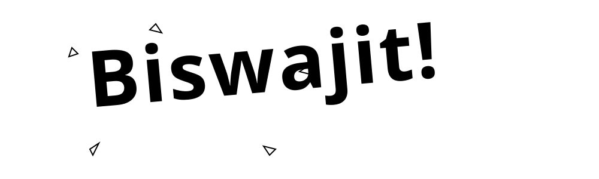

  

 

<h3 align="center">Know About Me</h3>

---

  
   
  <h4>Hey there! I'm Karthick</h4>
  
I'm an AI & Data Science undergrad fueled by sambar and an unhealthy obsession with minimalist dark themes. By day, I pretend to understand the universe. By night, I write Python scripts to automate myself out of doing actual work. When I'm not coding, I'm usually crashing helicopters in GTA V or treating my Clash of Clans village like a highly stressful Fortune 500 company.

 

 

### Top Projects (built to avoid manual labor)

---

  
   
   &nbsp; Secure file sharing, because some code needs to self-destruct gracefully.  
  
   &nbsp; A Discord bot that manages my server better than I manage my sleep schedule.  
  
   &nbsp; RAG-based AI to read text files for me, because reading is hard.  

 

 

<h3 align="center">Connect</h3>

---

  
  
  
  

 

> Code is never finished. It only becomes slightly less terrible over time.
> 
> Every commit I make is essentially just a small, desperate apology to my future self.
> Someday I will return to this codebase, look at the spaghetti I've written, and wonder who let me anywhere near a keyboard.

 

<h3 align="center">Contribution</h3>

---

  

