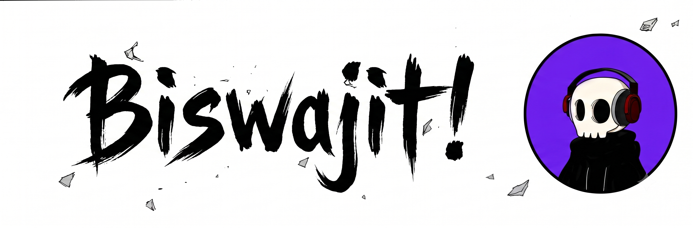

  
    
  &nbsp;
  &nbsp;
  

 

<h3 align="center">Know About Me</h3>

---

  
   
  <h4>Hey there! I'm Biswajit Nayak</h4>
  
I am a full-stack developer focused on building intelligent systems that solve real-world problems, not just demos that look good on GitHub. I enjoy working across frontend, backend and AI-driven applications, while continuously learning through real projects, hackathons and open source.

 

 

### Top Projects

---

  
  

     &nbsp; An emotion-aware system because feelings are too complex to process manually.
  

   
  

     &nbsp; AI-Powered Sports Piracy Detection Platform.
  

 

 

<h3 align="center">Tech Stack</h3>

---

   
  <table border="0" align="center">
    <tr>
      <td align="center" width="120">
         
         <strong>React</strong> FRONTEND 
      </td>
      <td align="center" width="120">
         
         <strong>TypeScript</strong> LANGUAGE 
      </td>
      <td align="center" width="120">
         
         <strong>Node.js</strong> BACKEND 
      </td>
      <td align="center" width="120">
         
         <strong>Python</strong> AI / ML 
      </td>
      <td align="center" width="120">
         
         <strong>C++</strong> LANGUAGE 
      </td>
    </tr>
    <tr>
      <td align="center" width="120">
         
         <strong>Git</strong> TOOLS 
      </td>
      <td align="center" width="120">
         
         <strong>Docker</strong> DEVOPS 
      </td>
      <td align="center" width="120">
         
         <strong>Next.js</strong> FRONTEND 
      </td>
      <td align="center" width="120">
         
         <strong>FastAPI</strong> BACKEND 
      </td>
      <td align="center" width="120">
         
         <strong>Firebase</strong> BACKEND 
      </td>
    </tr>
    <tr>
      <td align="center" width="120">
         
         <strong>MongoDB</strong> DATABASE 
      </td>
      <td align="center" width="120">
         
         <strong>PostgreSQL</strong> DATABASE 
      </td>
      <td align="center" width="120">
         
         <strong>Google Cloud</strong> CLOUD 
      </td>
      <td align="center" width="120">
         
         <strong>Tailwind CSS</strong> FRAMEWORK 
      </td>
      <td align="center" width="120">
         
         <strong>PyTorch</strong> AI / ML 
      </td>
    </tr>
  </table>

 

 

<h3 align="center">Connect</h3>

---

  
  
  

 

> Code is never finished, it only becomes slightly less terrible over time.

 

> Looking to Collaborate On open source contribution and Creative problem-solving challenges

 

